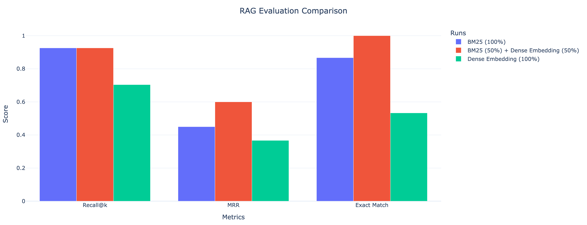

# Running Instructions 

```bash
python3 -m venv aig
```

```bash
source aig/bin/activate
```

```bash
pip install --upgrade pip
```

```bash
pip install -r requirements.txt 
``` 

In the first step, the data is loaded from Hugging Face, and the train, validation, and test splits are saved in `parquet` format in the `parquet` folder. After this, the train, validation, and test splits are combined, and only the records that belong to AIG are extracted. Next, the data is converted from wide format to tidy format, the empty sections are dropped, and the excessive whitespace is removed from the sections. Lastly, the sections are split into chunks using recursive chunking, dense embeddings are obtained for each chunk, and the results are saved in the `./vector-database` folder in `parquet` format.

**Note**: Considering the structure and content of the data and the objective of this assignment, using only dense embeddings is not a good approach. My initial default approach was to use only keyword-based/sparse retrieval methods such as TF-IDF or BM25. However, to be able to evaluate different systems, I also wanted to include dense embeddings.


```bash
python indexing.py \
    --embedding-model text-embedding-3-small \
    --chunk-size 2000 \
    --chunk-overlap 100 \
    --parquet-dir ./parquet \
    --output-dir ./vector-database
```

After splitting the sections into chunks and representing each chunk with a dense embedding, the next step is to retrieve relevant chunks and generate a response based on the user query. Here, a hybrid search is performed. In other words, when the user writes a query, the relevant chunks are retrieved using both a sparse retriever and a dense retriever. And the importance of these retrievers is controlled by the alpha parameter. Alpha = 0 means that we only take the sparse retriever’s (BM25) retrieved chunks into account. Alpha = 1 means that we only take the dense retriever’s retrieved chunks into account. I kept alpha = 0.5 by default.

```bash
python rag.py \
    --query "How much collateral did AIG hold at December 31, 2015?" \
    --alpha 0.5 \
    --dense-emb-path ./vector-database/config_text-embedding-3-small_2000_100/aig.parquet \
    --top-k 10 \
    --embedding-model text-embedding-3-small \
    --chat-model gpt-4o-mini \
    --temperature 0.0 \
    --max-tokens 500
```

Lastly, based on the ground truth data I created manually (which is located in the `ground-truth` folder), the exact match score, recall@k, and mean reciprocal rank (MRR) scores are computed below.

```bash
python evaluate.py \
    --gt-path ./ground-truth/ground_truth.json \
    --alpha 0.0 \
    --dense-emb-path ./vector-database/config_text-embedding-3-small_2000_100/aig.parquet \
    --top-k 10 \
    --embedding-model text-embedding-3-small \
    --chat-model gpt-4o-mini \
    --temperature 0.0
```
# Results

